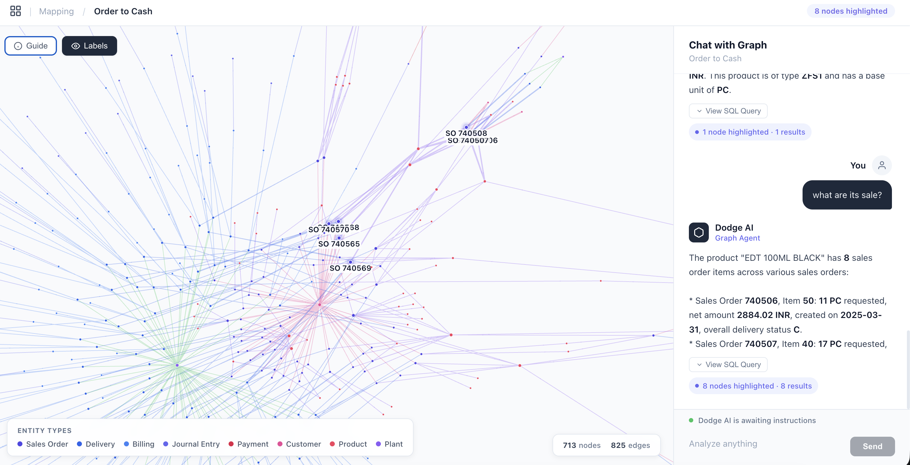
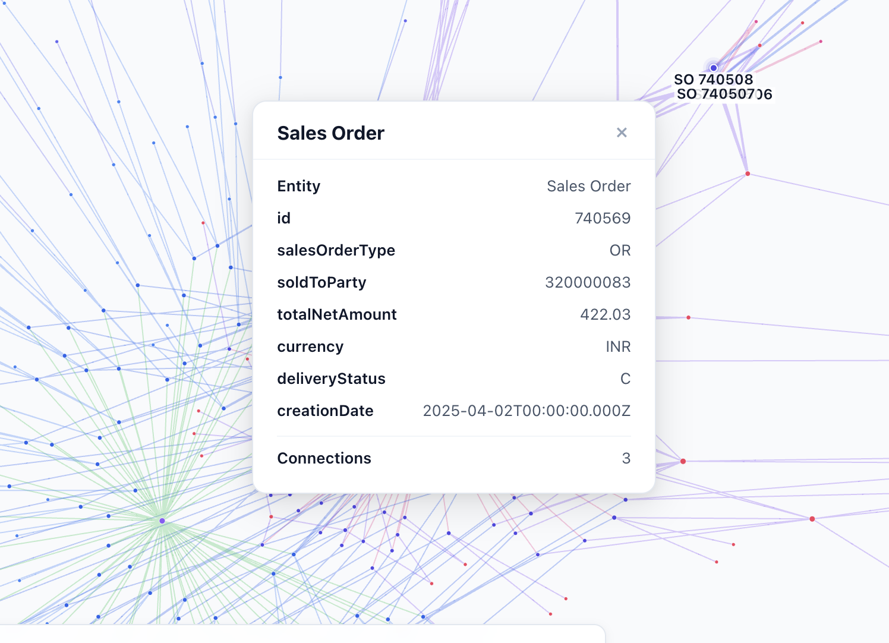
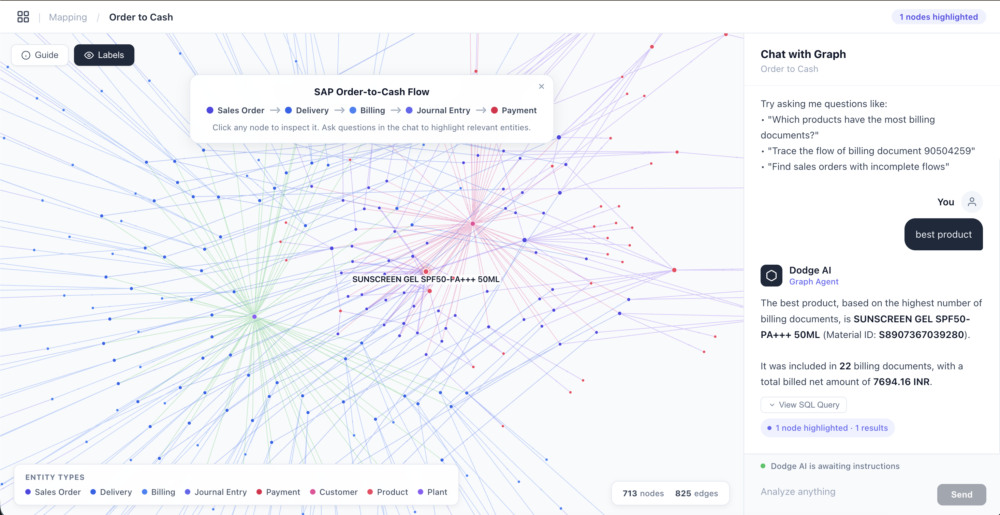

# SAP O2C Graph Explorer

An interactive graph-based data modeling and query system for SAP Order-to-Cash (O2C) data. Built for the Dodge AI Forward Deployed Engineer assignment.

## Screenshots

### Graph Visualization with Chat-Driven Highlighting

*Ask questions in natural language — the graph auto-zooms and highlights relevant entities. Edges are color-coded by relationship type with directional arrows showing the O2C flow.*

### Node Inspector

*Click any node to inspect its full metadata — entity type, IDs, amounts, dates, status, and connection count.*

### Product Query with Flow Visualization

*The welcome guide shows the O2C pipeline. Chat responses highlight relevant products in the graph and display generated SQL.*

## Architecture

```
┌─────────────────────────────────────────────────────────┐
│                   FRONTEND (React + Vite)                │
│  ┌─────────────────┐  ┌──────────────────────────────┐  │
│  │ GraphPanel       │  │ ChatPanel                     │ │
│  │ react-force-     │  │ - NL input                    │ │
│  │ graph-2d         │◄─┤ - SSE streaming               │ │
│  │ - click expand   │  │ - SQL display                 │ │
│  │ - auto-zoom      │  │ - Conversation history        │ │
│  │ - highlighting   │  │ - Node highlight triggers     │ │
│  └─────────────────┘  └──────────────────────────────┘  │
│         Zustand store: highlightedNodeIds                │
└──────────────────────────┬──────────────────────────────┘
                           │ REST + SSE
┌──────────────────────────┴──────────────────────────────┐
│                  BACKEND (FastAPI + Python)               │
│                                                          │
│  Endpoints:                                              │
│  GET  /api/graph?limit=500&entityType=all                │
│  GET  /api/node/{nodeId}                                 │
│  GET  /api/expand?nodeId=SO:740506                       │
│  POST /api/chat (SSE stream)                             │
│  GET  /api/schema                                        │
│  GET  /api/node-types                                    │
│  GET  /api/broken-flows                                  │
│                                                          │
│  ┌──────────┐  ┌──────────┐  ┌────────────────────────┐ │
│  │ NetworkX │  │ Gemini   │  │ Guardrails (3-layer)   │ │
│  │ graph    │  │ 2.5 Flash│  │ 1. keyword check       │ │
│  │ analysis │  │ NL→SQL   │  │ 2. system prompt       │ │
│  └────┬─────┘  └────┬─────┘  │ 3. SQL output validate │ │
│       │              │        └────────────────────────┘ │
│  ┌────┴──────────────┴──────┐                            │
│  │    SQLite (WAL mode)     │                            │
│  │    19 tables from JSONL  │                            │
│  └──────────────────────────┘                            │
└──────────────────────────────────────────────────────────┘
```

## Key Technical Decisions

| Decision | Choice | Rationale |
|----------|--------|-----------|
| Database | SQLite | Zero deployment friction, JSONL data is tabular, SQL is easier for LLMs to generate than Cypher |
| Graph engine | NetworkX (server-side) | Graph analysis (path finding, broken flows) without graph DB overhead |
| Graph viz | react-force-graph-2d | Canvas-based, handles 700+ nodes, mature React component |
| LLM | Gemini 2.5 Flash + 2.0 Flash-Lite fallback | Flash for SQL quality, auto-fallback on rate limits |
| Streaming | SSE (not WebSocket) | Simpler, unidirectional sufficient, FastAPI native |
| State mgmt | Zustand | Minimal boilerplate for chat-to-graph communication |

## Graph Data Model

```
SalesOrder ──SOLD_TO──→ Customer
SalesOrder ──HAS_ITEM──→ Product
SalesOrder ──DELIVERED_BY──→ Delivery ──FROM_PLANT──→ Plant
Delivery ──BILLED_IN──→ BillingDocument
BillingDocument ──POSTED_AS──→ JournalEntry
JournalEntry ──CLEARED_BY──→ Payment
```

**713 nodes** across 8 entity types, **825 edges** across 7 relationship types, ingested from **19 JSONL entity tables**.

## LLM Prompting Strategy

The NL-to-SQL pipeline uses a two-pass approach:

1. **Query Pass:** Send user question + full database schema + sample rows + FK relationship descriptions + example SQL templates to Gemini 2.5 Flash. The model generates a SQL query wrapped in a code block.
2. **Summary Pass:** Execute the SQL against SQLite, then send the results back to Gemini for a natural language summary with specific document IDs and amounts. The summary prompt enforces using only the actual result data, preventing hallucination from conversation history.

The system prompt includes the complete schema, sample data from key tables, explicit JOIN relationship descriptions, and critical SQL templates for the three assignment queries so the LLM can generate correct multi-table queries.

**Auto-retry:** If generated SQL fails execution, the error is fed back to the LLM for a corrected query attempt.

## Guardrails (3-Layer)

```
User Input
    │
    ├─ Layer 1: KEYWORD CHECK (fast, no LLM call)
    │   Strong keywords (order, billing, etc.) → pass immediately
    │   Weak keywords (amount, date) → need 2+ matches
    │   Document IDs (6+ digits) → pass
    │   With conversation history → allow follow-ups, block injection
    │   No match → reject with domain message
    │
    ├─ Layer 2: SYSTEM PROMPT (defense in depth)
    │   Gemini system prompt restricts to O2C domain
    │   Explicit instruction to refuse off-topic queries
    │
    └─ Layer 3: SQL OUTPUT VALIDATION
        - Regex: only SELECT statements (no DROP/DELETE/UPDATE/INSERT)
        - sqlparse: validate table names against known schema
        - No raw error messages exposed to users
```

**Tested against:** off-topic queries (weather, poems, recipes), prompt injection (role override, instruction bypass, admin commands), SQL injection (DROP TABLE, Bobby Tables), and conversational edge cases.

## Features

- **Interactive Graph Visualization:** Force-directed graph with 713 nodes, color-coded by entity type, directional arrows showing O2C flow
- **Auto-Zoom to Results:** Chat responses automatically zoom the graph camera to highlighted entities
- **Color-Coded Edges:** Different relationship types (delivery, billing, payment) have distinct colors
- **NL-to-SQL Chat:** Ask questions in natural language, see generated SQL and formatted results
- **Node Highlighting:** Chat results highlight relevant nodes with glow rings and labels
- **Click-to-Inspect:** Click any node for detailed metadata tooltip
- **Click-to-Expand:** Click nodes to reveal their connected neighbors
- **Broken Flow Detection:** Identifies sales orders with incomplete O2C flows
- **Conversation Memory:** 10-message sliding window per session with contextual follow-ups
- **SSE Streaming:** Real-time response streaming from the LLM
- **SQL Display:** Collapsible SQL block showing the generated query
- **Welcome Guide:** O2C flow diagram overlay for first-time users
- **Smart Guardrails:** 3-layer protection against off-topic, injection, and unsafe SQL

## Setup

### Prerequisites
- Python 3.9+
- Node.js 18+
- Gemini API key ([Get one here](https://aistudio.google.com/apikey))

### Local Development

```bash
# Clone
git clone https://github.com/Sakshamm-Goyal/Dodge-AI-FDE.git
cd Dodge-AI-FDE

# Backend
pip install -r backend/requirements.txt
echo "GEMINI_API_KEY=your_key_here" > .env

# Start backend (auto-ingests data on first run)
uvicorn backend.main:app --reload --port 8000

# Frontend (in another terminal)
cd frontend
npm install
npm run dev
```

Open http://localhost:5173 to use the app.

### Run Tests

```bash
python -m pytest backend/test_api.py -v
# 20 tests covering ingestion, guardrails, SQL validation, FK relationships, and API endpoints
```

### Production Build

```bash
cd frontend && npm run build
# Backend serves frontend from frontend/dist/
uvicorn backend.main:app --host 0.0.0.0 --port 8000
```

## Example Queries

1. **"Which products are associated with the highest number of billing documents?"** — Generates a multi-table JOIN with GROUP BY and ORDER BY, returns top products with billing counts.
2. **"Trace the full flow of billing document 90504259"** — Traces the O2C chain: billing 90504259 → delivery 80738080 → sales order 740560 → journal entry 9400000260.
3. **"Identify sales orders with broken or incomplete flows"** — Finds 17 orders with missing deliveries or billing using LEFT JOIN + IS NULL patterns.
4. **"Which customer has the most sales orders?"** — Nelson, Fitzpatrick and Jordan (320000083) with 72 orders.
5. **"Show me the best selling product" → "What is the 2nd best?" → "3rd?"** — Conversational follow-ups with correct OFFSET/LIMIT progression.

## Project Structure

```
Dodge-AI-FDE/
├── backend/
│   ├── main.py           # FastAPI app, routes, lifespan
│   ├── database.py       # SQLite ingestion, schema, FK validation
│   ├── graph.py          # NetworkX graph construction + analysis
│   ├── llm.py            # Gemini NL→SQL pipeline + auto-retry
│   ├── guardrails.py     # 3-layer query validation
│   ├── models.py         # Pydantic schemas
│   ├── test_api.py       # Integration tests (20 tests)
│   └── requirements.txt
├── frontend/
│   ├── src/
│   │   ├── App.tsx              # Main layout + legend + guide
│   │   ├── components/
│   │   │   ├── GraphPanel.tsx   # Force-directed graph + auto-zoom
│   │   │   └── ChatPanel.tsx    # Chat interface + markdown
│   │   ├── hooks/useChat.ts     # SSE streaming hook
│   │   ├── store.ts             # Zustand state
│   │   └── types.ts             # TypeScript types
│   └── package.json
├── sap-o2c-data/         # JSONL dataset (19 entities)
├── Sample-Image/         # Screenshots
├── render.yaml           # Render deployment config
└── README.md
```
